# Azure AI Foundry

In this lab you will log in to Azure, explore your resources, upload data to blob storage, and build your first AI agent in Azure AI Foundry. By the end you will have a working agent backed by a GPT model running entirely within your organization's security boundary — and you will understand *why* that matters from a corporate governance perspective.

---

## Part 1 — Log In to Azure

1. Open [https://portal.azure.com](https://portal.azure.com) and sign in with the credentials your instructor provided.
2. You will be prompted to **create a new password**. Save this password somewhere safe — you will need it for the rest of the course.
3. You will be required to set up **Multi-Factor Authentication (MFA)**.

> **IMPORTANT:** Download the official **Microsoft Authenticator** app (free). Do not download any paid look-alikes. All Azure accounts require MFA — there is no workaround.

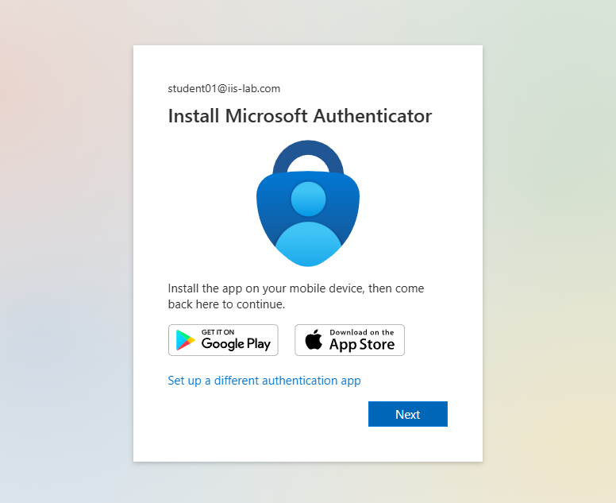

4. Complete the MFA setup, then sign in to the Azure Portal.

---

## Part 2 — Explore Your Resources

Use the search bar at the top of the Azure Portal to search for **"Resource groups"** and select it.

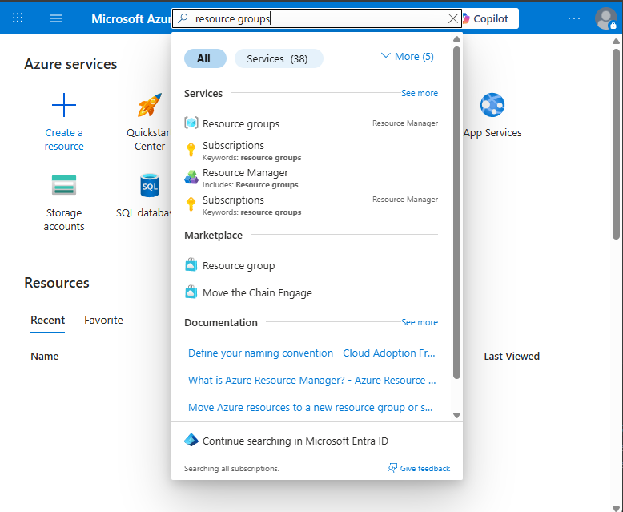

You will see two resource groups:

| Resource Group | Purpose |
|---|---|
| **rg-lab-global** | Shared infrastructure (AI Foundry, Search, models) — managed by your instructor |
| **rg-studentXX** | Your personal resource group (storage, experiments) |

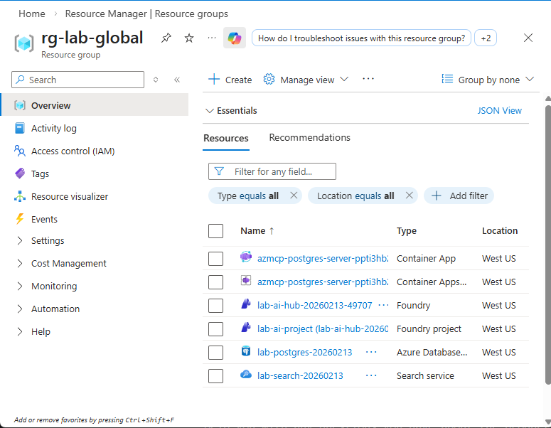
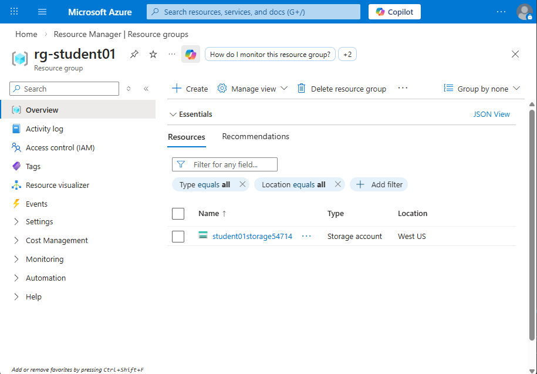

Click into **your student resource group** (e.g. `rg-student06`). Inside you will find an **Azure Storage Account**. This is a cloud-based file storage service — think of it like a secure, scalable file system in the cloud. You will use it to upload data that your AI agent can later search.

---

## Part 3 — Explore the Global Resource Group

Go to the global resource group and examine what is in there.

- **PostgreSQL Database:** Stores our products, customers, and sales data in a traditional relational database. This is the kind of structured data that most businesses already have.
- **MCP Container Application:** A Model Context Protocol (MCP) server that allows AI Agents to use Text-to-SQL to retrieve data. Instead of writing SQL queries by hand, the AI agent translates natural language questions into database queries automatically — so a manager can ask "What were our top-selling products last quarter?" and get an answer without knowing SQL.
- **Foundry Hub and Project:** Microsoft's unified AI platform for building, deploying, and managing AI applications. The Hub is the shared infrastructure layer (model deployments, security settings, connections), while the Project is your team's workspace where you build and test agents. Think of the Hub as the building and the Project as your office inside it.
- **Search Service:** Azure AI Search is a cloud-based search engine that goes beyond simple keyword matching. It powers the retrieval side of our AI agents — when an agent needs to find relevant information (like customer reviews or product documentation), it queries this search service to find the most relevant results.

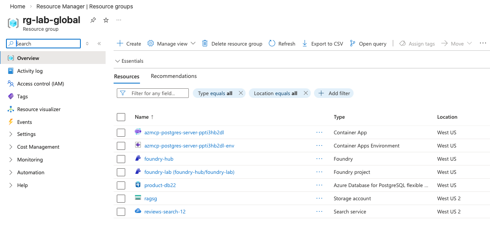


Within the research group, click on the resource with type "Search Service"

Then on the left under search management select Indexes.

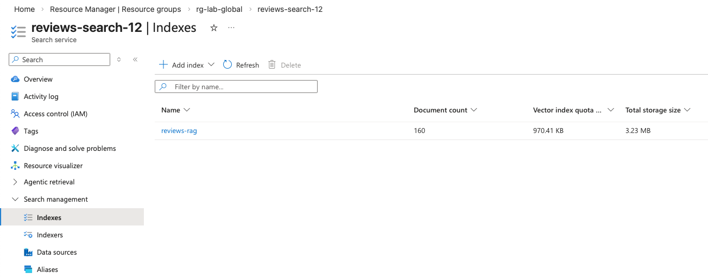

Select the **reviews-rag** index. This index was built from our customer reviews CSV file and is the foundation of a technique called **RAG (Retrieval-Augmented Generation)**. Here is how it works: each customer review was processed through a Foundry text embedding model, which converted the human-readable text into numerical vectors — mathematical representations that capture the *meaning* of the words, not just the words themselves. These vectors are stored in the index alongside the original text.

Use this index to search customer reviews. Try searching for something like "bad experience with delivery" or "loved the product quality." Notice that **semantic search is superior to traditional text search** because it understands meaning and intent, not just exact keyword matches. A traditional text search for "slow shipping" would miss a review that says "my package took forever to arrive" — but semantic search recognizes these mean the same thing. This is what makes RAG powerful for business: your AI agent can find genuinely relevant information even when customers use different words to describe the same experience.

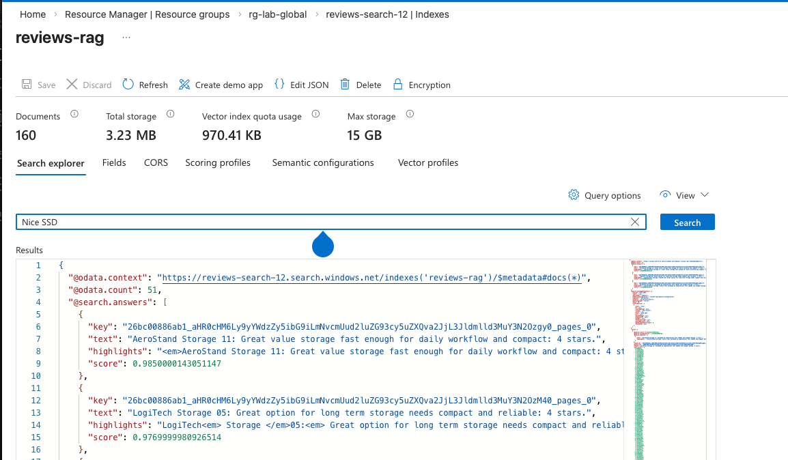


---

## Part 4 — Access Azure AI Foundry

Azure AI Foundry is Microsoft's platform for building, deploying, and managing AI applications within your organization's security boundary. Unlike consumer AI tools (such as ChatGPT or Google Gemini on the public web), everything processed in Foundry stays within your Azure tenant. This means your proprietary data, customer information, and internal documents never leave your organization's control — a critical requirement for any regulated industry or enterprise with data governance policies.

1. In the Azure Portal search bar, search for **"Foundry"** and select **Azure AI Foundry**. You can also use the global resource group to find the Foundry project.

2. Select the project you see (e.g. `foundry-lab`) to enter the Foundry portal.
3. Make sure **"New Foundry"** is toggled on at the top of the page.

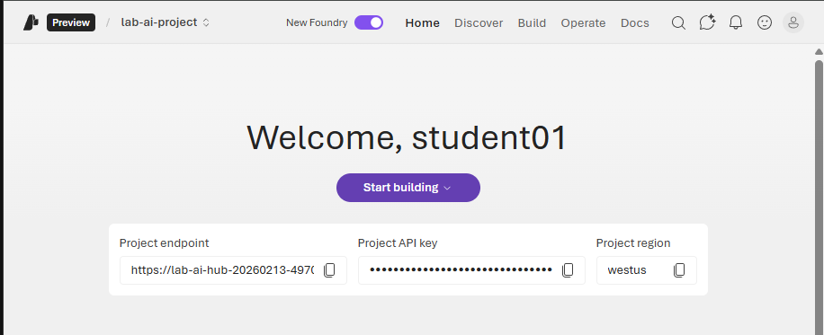

---

## Part 5 — Explore the Model Playground

1. In the Foundry portal, click **Build** in the top-right menu, then select **Models**.

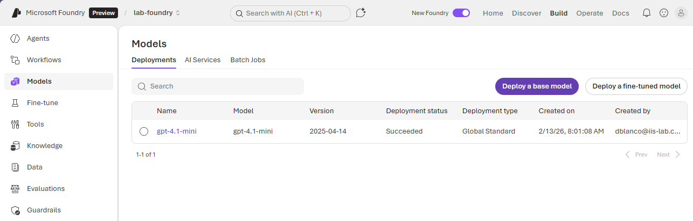

Select **"Deploy a base model"** and search for **gpt-4.1**. Before deploying, take a moment to read the model's profile page — it tells you the model's capabilities, token limits, pricing tier, and what types of tasks it excels at. Understanding these details is how business leaders make informed decisions about which model to use for a given project (balancing cost, speed, and quality).

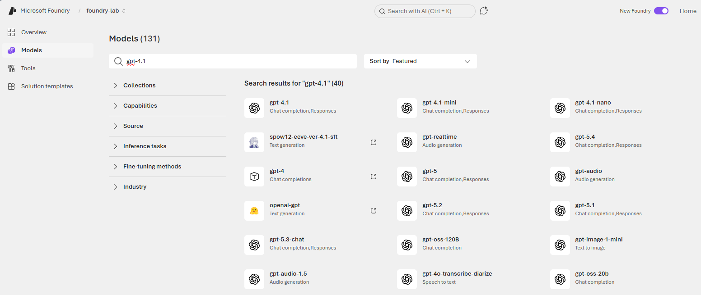

Read the profile of the model.

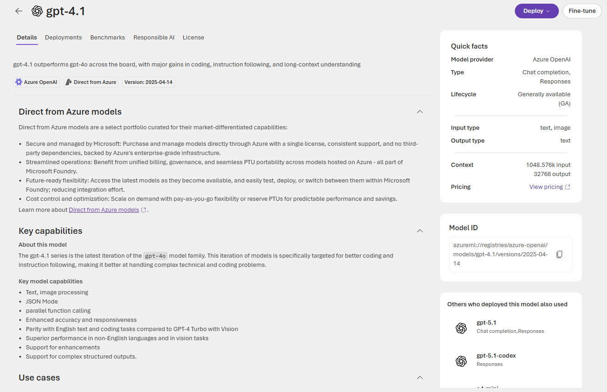

Navigate back to the models and select **Compare Models**. This is one of the most valuable features for decision-makers. Compare the different models you have been using throughout the course — look at quality benchmarks, safety ratings, cost per token, and context window sizes. Notice how some models are cheaper but less capable, while others offer premium quality at higher cost. In a real business scenario, you would use this comparison to choose the right model for each use case: a simple FAQ chatbot does not need the most expensive model, but a legal document analyzer might.

Go back to the models by clicking **Build** in the top-right menu, then select **Models**.


2. Select the **gpt-4o** model and click **Open in Playground**.

The Playground lets you interact with the model directly — think of it as a sandbox where you can experiment before building anything into production. Take a moment to explore the configuration options on the right side:

| Setting | What it does |
|---|---|
| **System Message** | Instructions that define how the model behaves (its "personality" and rules) |
| **Temperature** | Controls randomness — lower = more consistent, higher = more creative |
| **Max Tokens** | Limits the length of the response |
| **Top P** | Another way to control response diversity |

---

## Part 6 — Build Your First Agent

Now create a custom agent by giving it a system message. The system message defines who the agent is and how it should respond.

**Try this:** In the **System Message** box, enter instructions that tell the model to respond as if it were Agent 007 from James Bond. For example:

```
You are Agent 007, a suave British intelligence officer. Respond to all questions 
with confidence, wit, and a touch of dry humor. Stay in character at all times. 
When discussing technical topics, relate them back to espionage and field operations.
```

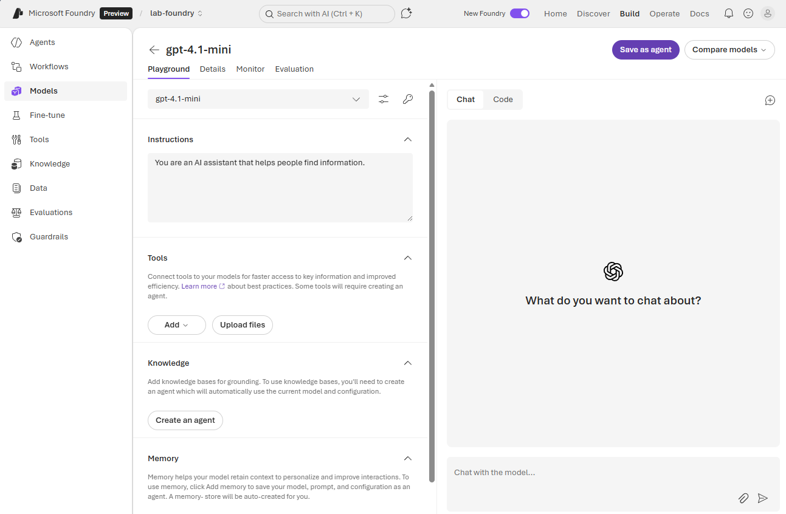

Test your agent with a few questions:
- *"How should I secure my cloud infrastructure?"*
- *"What's the best way to handle a data breach?"*
- *"Explain zero trust to me."*

Notice how the system message changes the model's behavior without changing the underlying model itself. This is prompt engineering in action.

---

## Part 7 — Save Your Agent

Once you are happy with your agent's behavior:

1. Click **Save** at the top of the Playground.
2. Name your agent with your student number (e.g. `student06-agent`).

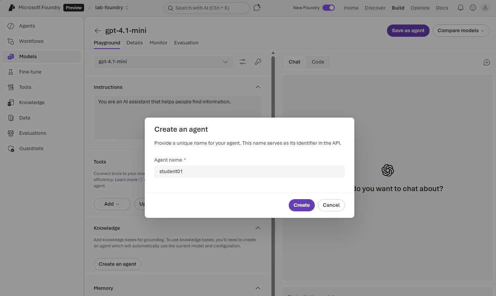

---

## Part 8 — Use Your Agent from VS Code

You can also interact with your Azure AI Foundry agent directly from VS Code, without leaving your development environment.

1. Open **VS Code** and sign in to your Azure account using the **Azure** extension in the left sidebar.

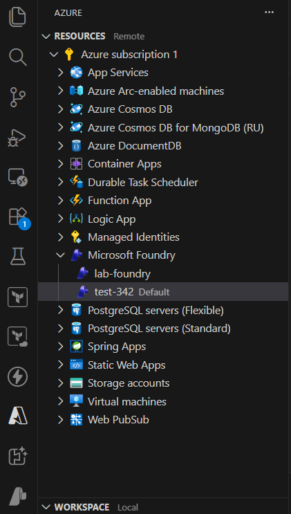

2. Open the **Foundry** extension panel. You will see the agent you just created listed under your project.
3. Select your agent to start a conversation — just like in the Foundry portal, but now integrated into your coding workflow.

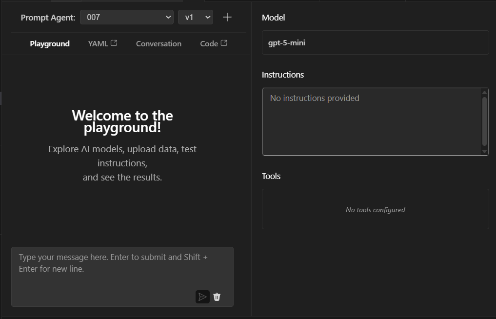

> **Why does this matter?** In a real development workflow, switching between a browser-based AI portal and your code editor slows you down. The Foundry extension lets developers test and iterate on agents without leaving VS Code — keeping your tools, terminal, and AI all in one place.

---

## Part 9 — Corporate Governance and Enterprise AI

Before we move on, let's step back and talk about **why** your organization would use Azure AI Foundry instead of just giving everyone a ChatGPT subscription.

### Where Does Your Data Actually Go?

When you type a prompt into ChatGPT, Claude, or Gemini's consumer products, your data leaves your organization and travels to the provider's infrastructure. Depending on the provider and plan, that data may be:

- Stored on servers you don't control
- Used to improve or fine-tune future models
- Subject to another country's data residency laws
- Accessible to the provider's staff for review

**Azure AI Foundry changes this entirely.** When you use a model through Azure:

| Concern | Consumer AI (ChatGPT, etc.) | Azure AI Foundry |
|---|---|---|
| **Data location** | Provider's infrastructure, often US-based | Your Azure tenant — you choose the region |
| **Model training** | Your data may be used to train models | **Your data is never used to train models** |
| **Data retention** | Varies by provider and plan | You control retention policies |
| **Access control** | Email + password | Azure AD, MFA, RBAC, Conditional Access |
| **Compliance** | Limited visibility | SOC 2, ISO 27001, HIPAA, FedRAMP, GDPR |
| **Audit trail** | None | Full audit logs of every interaction |

> **Key point:** Microsoft's Azure OpenAI Service has a contractual commitment — **your prompts and completions are not available to OpenAI and are not used to train any models.** This is fundamentally different from using OpenAI's consumer API.

### Who Accessed What?

In a corporate environment, "we use AI" is not enough — leadership, compliance, and legal teams need to know:

- **Who** is using the AI models?
- **What** data are they sending to the model?
- **When** did they access it?
- **What** did the model respond with?

Azure provides this through:

- **Azure Activity Logs** — every API call, deployment change, and permission modification is logged
- **Tracing** — Azure AI Foundry can capture the full chain of an agent's actions: the user prompt, the system message, any tool calls (like search), and the final response
- **Application Insights** — detailed telemetry on latency, errors, token usage, and user sessions
- **Role-Based Access Control (RBAC)** — administrators define exactly who can deploy models, who can use them, and who can view logs

In this lab environment, your instructor can see every model interaction, every agent you create, and every file you upload. In a real enterprise, this same visibility is what lets a CISO sign off on an AI deployment.

### Guardrails — Controlling What the Model Can Do

Enterprise AI is not just about access control — it's about **content control**. Azure AI Foundry provides built-in guardrails:

- **Content filters** — automatically block harmful, violent, sexual, or self-harm content in both inputs and outputs
- **Jailbreak detection** — detect and block prompt injection attempts that try to bypass the system message
- **Custom blocklists** — define organization-specific terms or topics the model must never discuss (e.g., competitor names, unreleased product details, classified project codenames)
- **Grounding detection** — flag when the model generates information that isn't supported by provided data (hallucinations)

These guardrails run automatically on every request. A developer cannot bypass them — they are enforced at the platform level.

### Azure Policy — Governance at Scale

Beyond individual model guardrails, Azure uses **Azure Policy** to enforce organizational rules across all resources:

- Restrict which AI models can be deployed (e.g., only GPT-4o-mini, no open-source models)
- Enforce specific Azure regions for data residency (e.g., all AI resources must be in `westus`)
- Require specific SKU tiers to control costs
- Block users from creating their own AI deployments outside approved projects

In this lab, your instructor has applied policies that prevent you from deploying your own models or creating expensive resources — you can only use what has been provisioned for you. This mirrors how enterprises control AI sprawl.

### Why This Matters

Without governance, AI adoption in an enterprise becomes a liability:

- Employees paste customer PII into ChatGPT → **data breach**
- A department deploys an unvetted open-source model → **no audit trail, no content filters**
- A model hallucinates legal advice that the company acts on → **no grounding detection, no tracing**
- Nobody knows which teams are using AI or how much it costs → **shadow AI**

Azure AI Foundry gives organizations a way to say **"yes"** to AI while maintaining the controls that compliance, legal, and security teams require. The goal is not to block AI — it's to enable it responsibly.

---

## Reflection

- How does using Azure AI Foundry differ from using ChatGPT or Claude directly?
- What security advantages does running a model inside your Azure tenant provide?
- If you pasted real incident data into the playground, where does that data go? Who can see it?
- Could you use the system message to prevent the model from discussing certain topics or revealing sensitive information?
- Your company's legal team asks: *"Can OpenAI see our data?"* — how would you answer?
- A department wants to use a free AI chatbot they found online. What risks should you flag?
- How would you explain the difference between a content filter and a system message to a non-technical executive?

---

## Summary

In this lab you:

1. Logged in to Azure with MFA and explored your resource groups
2. Created a blob storage container and uploaded business data
3. Accessed Azure AI Foundry — Microsoft's enterprise AI platform
4. Explored model configuration settings (temperature, system message, tokens)
5. Built and saved a custom AI agent using prompt engineering
6. Used your agent from VS Code via the Foundry extension
7. Learned how Azure keeps your data within your tenant, never trains models on it, and provides full audit trails, tracing, content filters, and policy-based governance

You now have a working AI agent running inside your organization's security boundary. In upcoming labs, you will build on this foundation — connecting data sources, adding guardrails, and testing your agent's resilience.