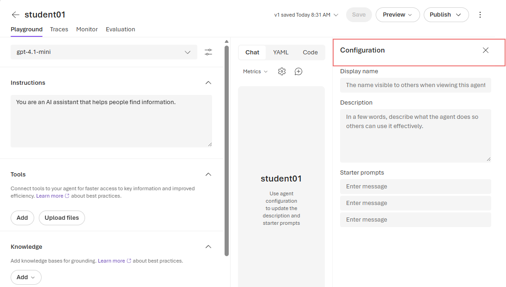
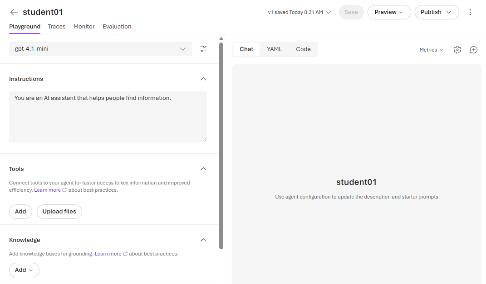
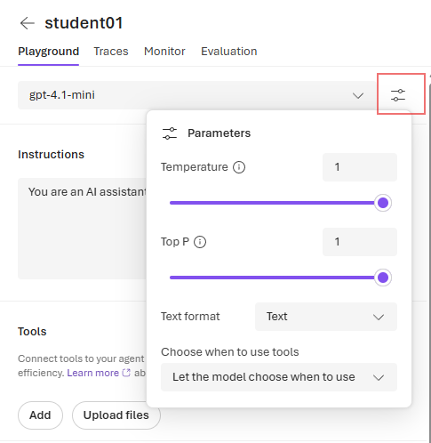
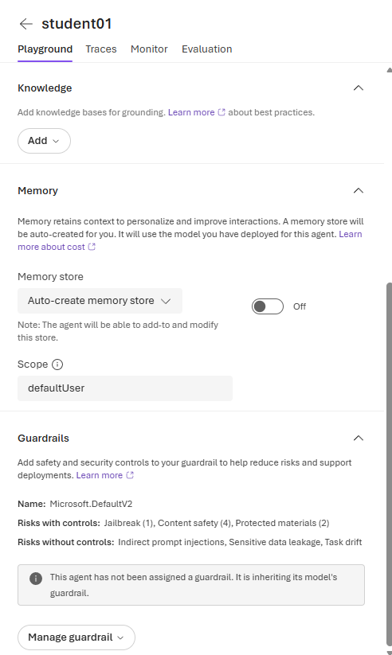
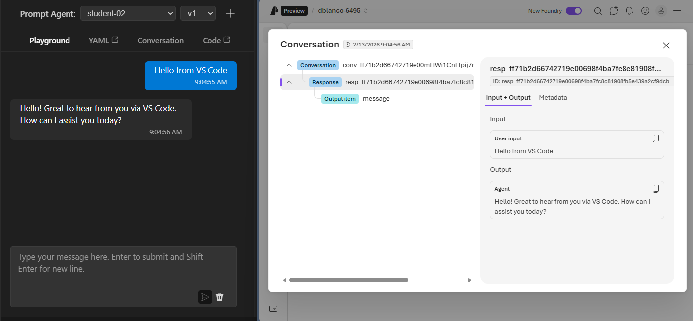
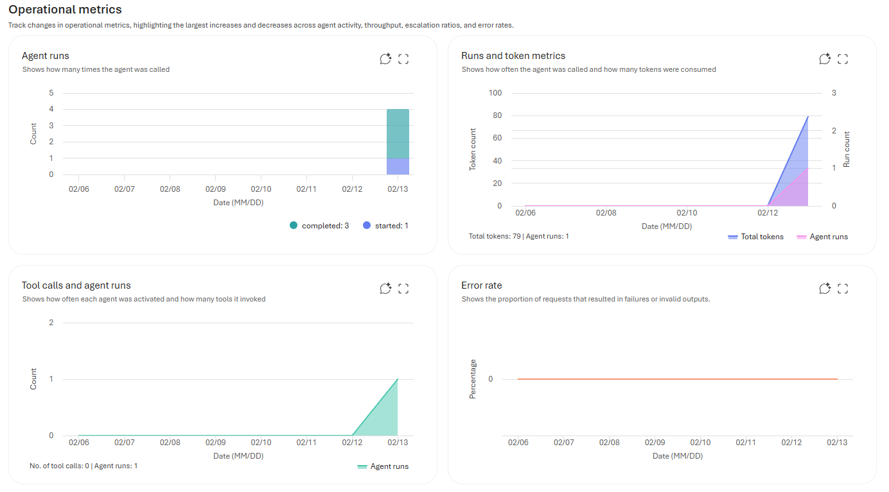

# Configuring Your Foundry Agent

In this lab you will explore the configuration options available for your AI agent in Azure AI Foundry. You will learn how to upload files for your agent to reference, tune model behavior with temperature and top-p settings, and discover the built-in tools Foundry provides for monitoring, tracing, and evaluating your agent.

---

## Part 1 — Agent Configuration Basics

1. Open [Azure AI Foundry](https://ai.azure.com) and navigate to your project.
2. Select the agent you saved in the previous lab (e.g. `student06-agent`).
3. Click on the **configuration panel** to view the settings available for your agent.

Here you can modify:

- **System Message** — the instructions that define your agent's behavior
- **Model selection** — which model powers your agent
- **Response format** — how the agent structures its output

Take a moment to review the settings. Notice that every change you make here affects how your agent responds — without changing the underlying model itself.

---

## Part 2 — Upload Files to Your Agent

Your agent can reference uploaded files when answering questions. This is useful when you want the agent to have access to specific documents, policies, or datasets.

1. In the agent configuration, look for the option to **upload files**.
2. Create a copy of `reviews.csv` named `reviews.txt`
3. Try uploading the `reviews.txt`

3. After uploading, ask your agent a question about the file contents. For example:
   - *"What are the most common complaints in the reviews?"*
   - *"Summarize the product information."*

> **Think about it:** When you upload a file to your agent, it stays within your Azure tenant. The model reads it at query time — but the file is never sent to OpenAI or used for model training. This is a key difference from pasting data into a consumer AI tool.

---

## Part 3 — Temperature and Top-P

Two important settings control how "creative" or "deterministic" your agent's responses are:

| Setting | What it does | Low value | High value |
|---|---|---|---|
| **Temperature** | Controls randomness of the output | More focused, consistent, predictable | More creative, varied, surprising |
| **Top-P** | Controls diversity by limiting the pool of tokens considered | Fewer choices → more predictable | More choices → more diverse |

**Try this experiment:**

1. Set **Temperature to 0.1** and ask: *"Write a one-paragraph security incident report for a phishing attack."*
2. Ask the same question 3 times — notice how similar the responses are.
3. Now set **Temperature to 1.0** and ask the same question 3 times — notice how the responses vary.

**When to use what:**

- **Low temperature (0.1–0.3)** — factual tasks, code generation, compliance reports, data extraction
- **Medium temperature (0.5–0.7)** — general conversation, summaries, explanations
- **High temperature (0.8–1.0)** — brainstorming, creative writing, generating diverse options

---

## Part 4 — Memory, Guardrails, and Knowledge

Foundry agents have additional advanced capabilities beyond the basic configuration. Review the advanced settings panel:

Here is a high-level overview of what's available — we will configure these in detail in later labs:

| Feature | What it does |
|---|---|
| **Memory** | Allows the agent to retain context across conversations. Without memory, each conversation starts fresh — the agent has no knowledge of previous interactions. |
| **Knowledge** | Connects external data sources (like Azure Search indexes or uploaded files) so the agent can ground its answers in real data instead of relying only on its training. |
| **Guardrails** | Content safety filters and rules that control what the agent can and cannot say. These are enforced at the platform level — developers and users cannot bypass them. |

> **Note:** For now, just review these options to understand what's available. We will apply guardrails and connect knowledge sources in upcoming labs.

---

## Part 5 — Tracing Agent Conversations

Every interaction with your agent is recorded. Azure AI Foundry provides a **Traces** view that lets you inspect the full chain of what happened during a conversation.

1. First, have a short conversation with your agent — ask it 2-3 questions.
2. Then navigate to the **Traces** section in Foundry.

In the traces view you can see:

- The **user prompt** — exactly what was sent to the model
- The **system message** — the instructions your agent was operating under
- Any **tool calls** — if the agent searched files, called an API, or used another tool
- The **model response** — what came back
- **Latency** — how long each step took
- **Token usage** — how many tokens were consumed (this directly affects cost)

> **Why this matters for security:** In an enterprise, tracing gives you a complete audit trail. If an employee's AI agent produces a problematic response, you can trace back to exactly what was asked, what data was referenced, and what the model returned. This is essential for incident response and compliance.

---

## Part 6 — Operational Metrics

Foundry also provides an **operational metrics** dashboard for your agent.

1. Navigate to the **Metrics** tab in your agent view.

Here you can monitor:

- **Request volume** — how many times the agent has been called
- **Latency** — average response times
- **Token consumption** — how many tokens are being used (and the associated cost)
- **Error rates** — failed requests or content filter triggers
- **User sessions** — how many distinct conversations are happening

These metrics are what an IT or security team would use to monitor AI usage across the organization — answering questions like *"How much are we spending on AI?"* and *"Are there any unusual usage patterns?"*

---

## Part 7 — Evaluations (AI Unit Tests)

Under the **Evaluations** tab, you can build structured tests for your agent — think of these as **unit tests for AI**.

Evaluations let you systematically test whether your agent:

- **Stays on topic** — does it refuse to answer questions outside its scope?
- **Resists prompt injection** — if a user tries to override the system message, does the agent comply or reject?
- **Protects sensitive data** — if the agent has access to confidential files, will it leak that information when cleverly prompted?
- **Produces grounded answers** — does it reference actual data, or does it hallucinate?
- **Maintains safety** — does it refuse harmful, biased, or inappropriate requests?

> **Enterprise context:** Evaluations are how organizations prove their AI is safe to deploy. Before an agent goes to production, it should pass a suite of evaluations — just like software passes QA testing before release. Azure AI Foundry gives you the tooling to build, run, and track these evaluations over time.

---

## Reflection

- Why would an organization care about tracing every AI interaction?
- If your agent's temperature is set to 1.0 and it's being used for compliance reports, what could go wrong?
- How would you use operational metrics to detect if an employee is misusing an AI agent?
- What kinds of evaluations would you run before deploying an agent that handles customer financial data?

---

## Summary

In this lab you:

1. Explored your agent's configuration options in Azure AI Foundry
2. Uploaded files for the agent to reference at query time
3. Experimented with temperature and top-p to understand how they affect response behavior
4. Reviewed advanced features: memory, knowledge sources, and guardrails
5. Inspected conversation traces — the full audit trail of every agent interaction
6. Viewed operational metrics for monitoring usage, cost, and errors
7. Discovered evaluations — structured tests to validate agent safety and reliability

You now have a solid understanding of how your agent is configured, monitored, and tested. In upcoming labs, you will put these tools to work — connecting real data, building evaluations, and hardening your agent for production use.

