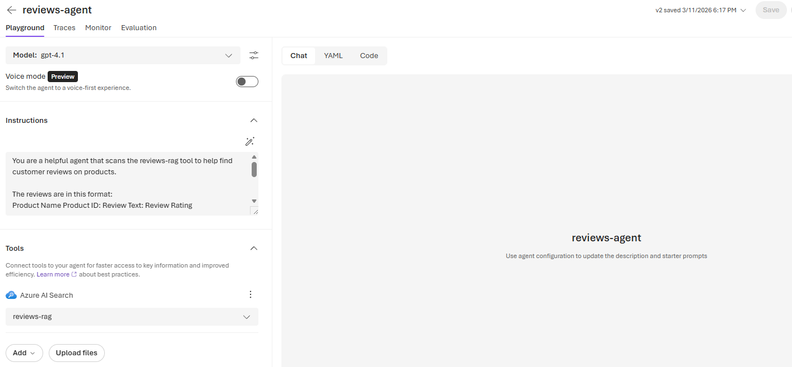
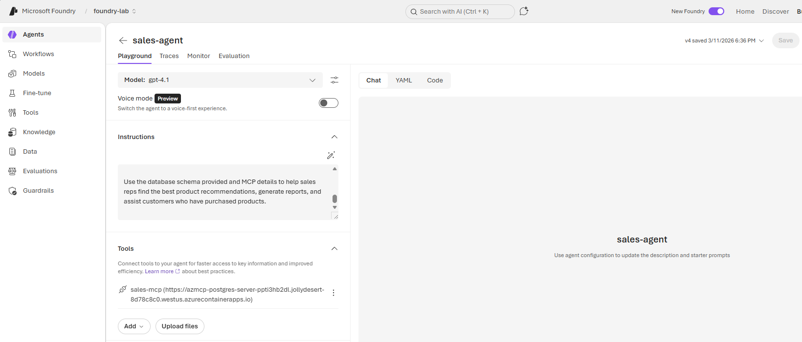
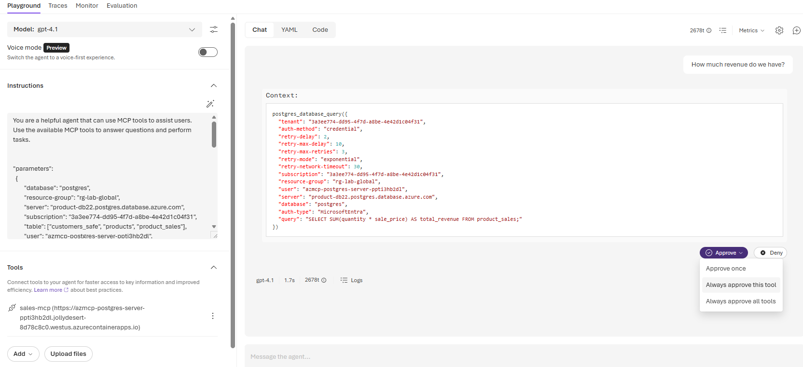

# Agents with Tools: RAG and MCP

In this lab you will build two new agents in Azure AI Foundry, each connected to a different **tool**. The first agent uses a RAG (Retrieval-Augmented Generation) search index to answer questions about customer reviews. The second agent uses an MCP (Model Context Protocol) server to query a live database using natural language. By the end you will understand how agents become truly useful when you give them access to real data — and you will see the difference between searching unstructured text and querying structured databases.

---

## Part 1 — Build a RAG-Powered Review Agent

In the Azure AI Foundry lab you explored the **reviews-rag** search index and saw how semantic search finds relevant customer reviews by meaning rather than keyword matching. Now you will connect that index to an agent so it can search reviews automatically when a user asks a question.

1. Open [Azure AI Foundry](https://ai.azure.com) and navigate to your project.
2. Create a new agent. Name it with your student number (e.g. `student06-rag-agent`).
3. In the **System Message** box, paste the following instructions:

```
You are a helpful agent that scans the reviews-rag tool to help find customer reviews on products.

The reviews are in this format:
Product Name Product ID: Review Text: Review Rating

Users may want a product recommendation. They may even want to compare similar products and customer feedback of those products.
```

4. Now you need to give the agent access to the search index. Add a **tool** to link your agent to the RAG index, as shown in the image below.



> **Why RAG instead of file upload?** Previously you uploaded a file directly to your agent. That works for static documents, but a RAG index can be **dynamic** — as new reviews come in, the index is updated and your agent immediately has access to the latest data. You do not need to re-upload anything. For a business with thousands of reviews coming in daily, this is the difference between a useful tool and a stale one.

5. Save your agent and test it with prompts such as:
   - *"A customer is looking for a storage device with good reviews"*
   - *"What speakers have the best sound quality?"*
   - *"Compare the top-rated headphones and summarize what customers like and dislike"*

Notice how the agent searches the review index, finds relevant reviews, and synthesizes an answer — all without you writing a single search query.

---

## Part 2 — Understand MCP (Model Context Protocol)

Before building the next agent, let's understand **MCP** — the technology that makes it possible.

**Model Context Protocol (MCP)** is an open standard that allows AI agents to connect to external tools and data sources through a unified interface. Think of it as a universal adapter: instead of writing custom code for every database, API, or service your agent needs to access, MCP provides a single protocol that the agent already knows how to use.

In our lab environment, an MCP server is running as a **Container Application** in Azure. This server sits between your AI agent and the PostgreSQL database. When your agent needs data, it sends a natural-language request to the MCP server, which translates it into a SQL query, runs it against the database, and returns the results. This is called **Text-to-SQL** — and it means a sales manager can ask "What region had the highest revenue last quarter?" without knowing anything about SQL or database schemas.

| Component | Role |
|---|---|
| **AI Agent** | Receives the user's question and decides it needs data from the database |
| **MCP Server** | Receives the agent's request, translates it to SQL, and runs the query |
| **PostgreSQL Database** | Stores the actual business data (products, customers, sales) |

This architecture keeps the AI agent separate from the database — the agent never connects directly. The MCP server acts as a controlled gateway, which is important for security and governance.

---

## Part 3 — Build an MCP-Powered Sales Agent

Now create an agent that can query the live database to answer business questions about products, customers, and sales.

1. Create a new agent in your Foundry project. Name it with your student number (e.g. `student06-mcp-agent`).
2. In the **System Message** box, paste the following instructions:

```
You are a helpful agent that can use MCP tools to assist users. Use the available MCP tools to answer questions and perform tasks.

"parameters":      
  {
        "database": "postgres",
        "resource-group": "rg-lab-global",
        "server": "product-db22.postgres.database.azure.com",
        "subscription": "3a3ee774-dd95-4f7d-a8be-4e42d1c04f31",
        "table": ["customers_safe", "products", "product_sales"],
        "user": "azmcp-postgres-server-ppti3hb2dl",       
  }

CREATE VIEW customers_safe AS
SELECT
    customer_id,
    first_name,
    last_name,
    city,
    state
FROM customers;

CREATE TABLE products (
  product_id   INTEGER GENERATED ALWAYS AS IDENTITY PRIMARY KEY,
  name         TEXT NOT NULL,
  description  TEXT NOT NULL,
  price        NUMERIC(10,2) NOT NULL CHECK (price >= 0)
);

CREATE TABLE product_sales (
  sale_id      INTEGER GENERATED ALWAYS AS IDENTITY PRIMARY KEY,
  product_id   INTEGER NOT NULL REFERENCES products(product_id),
  customer_id  INTEGER NOT NULL REFERENCES customers(customer_id),
  quantity     INTEGER NOT NULL CHECK (quantity > 0),
  sale_price   NUMERIC(10,2) NOT NULL CHECK (sale_price >= 0),
  sold_at      TIMESTAMP NOT NULL
);

Use the database schema provided and MCP details to help sales reps find the best product recommendations, generate reports, and assist customers who have purchased products.
```

3. Add the **MCP tool** to your agent as shown in the image below. This connects your agent to the MCP server running in Azure.



4. Save your agent and test it by asking a simple quantitative question:
   - *"How many customers do we have?"*



5. When prompted to run SQL, select **"Always approve this tool"**. Then make a small change to the system message (even just adding a space) and save the agent again. The agent will now run SQL queries without asking for approval each time.

6. Try asking real business questions:
   - *"What region has the highest revenue?"*
   - *"What product has the highest revenue?"*
   - *"What is our most expensive product?"*
   - *"Show me the top 5 customers by total spending"*
   - *"What were our total sales last month?"*

Notice how the agent translates your plain English questions into SQL queries, runs them against the live database, and returns formatted answers. This is the power of connecting AI agents to structured business data — no SQL knowledge required.

---

## Part 4 — Reflect: Two Agents, Two Data Sources

You now have two agents that demonstrate fundamentally different approaches to data retrieval:

| | RAG Agent (Reviews) | MCP Agent (Sales Data) |
|---|---|---|
| **Data type** | Unstructured text (customer reviews) | Structured data (database tables) |
| **Search method** | Semantic similarity (meaning-based) | SQL queries (exact data retrieval) |
| **Best for** | Qualitative questions ("What do customers think about...") | Quantitative questions ("How many...", "What is the total...") |
| **Data source** | Azure AI Search index | PostgreSQL database via MCP |

In a real enterprise, a production system would likely need **both** capabilities — answering "What's our best-selling product and what do customers say about it?" by querying the database for sales numbers and searching the review index for customer sentiment.

However, notice that we built these as **two separate agents** rather than combining everything into one. This is intentional and reflects a best practice in AI agent design: **single-purpose agents perform better than general-purpose ones.** When you give an agent too many tools and too broad a system message, it struggles to decide which tool to use, misinterprets what the user is asking for, and produces lower-quality results. A focused agent with a clear role — "you search reviews" or "you query sales data" — makes better decisions because it has less ambiguity about what it should do.

When a business process needs multiple capabilities, the better approach is to have a **coordinator** (sometimes called an orchestrator) that routes questions to the right specialized agent, rather than stuffing everything into a single agent and hoping it figures out which tool to reach for.