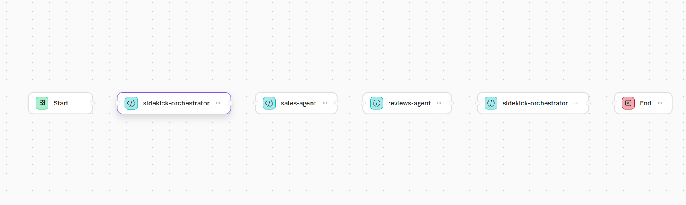
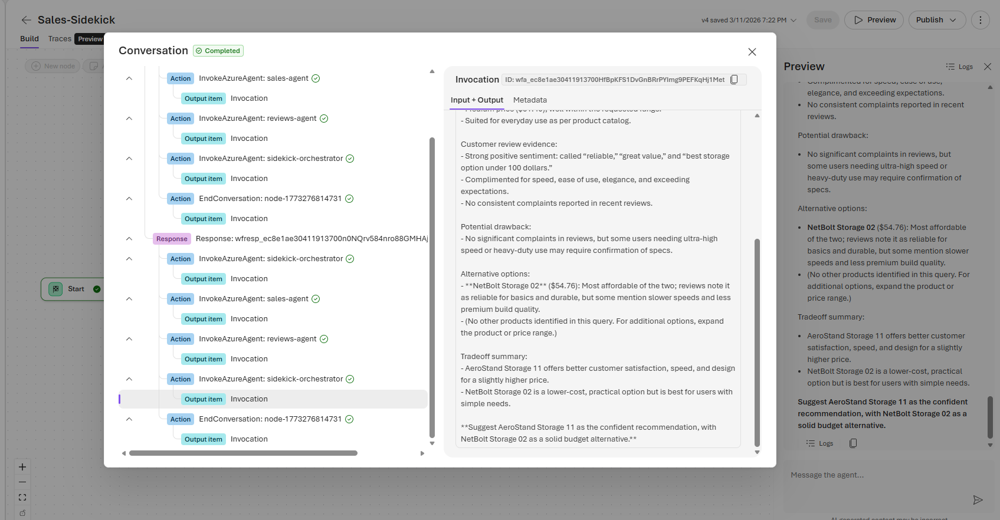

# Workflows and Sidekicks

In the previous lab you built two focused agents — one for customer reviews, one for sales data — and learned that single-purpose agents outperform general-purpose ones. But what happens when a business question requires *both* agents? In this lab you will build an **orchestrator agent** and connect all three agents together using a **Workflow** — Foundry's way of chaining multiple agents into an automated pipeline. The result is a **Sidekick**: an AI assistant that a sales rep can talk to naturally, while behind the scenes multiple specialized agents collaborate to produce a complete answer.

---

## Part 1 — What Is a Sidekick?

A **Sidekick** is a workflow-powered agent that acts as a single point of contact for the user while coordinating multiple specialist agents behind the scenes. The user asks one question; the Sidekick breaks it down, routes parts of the question to the right agents, and assembles their answers into a final recommendation.

Think of it like a team of analysts working for a sales manager. The manager asks "What storage device should I recommend to this customer?" One analyst pulls sales data and pricing, another reads through customer reviews, and a third synthesizes both into a recommendation. The manager only talks to one person — the orchestrator — but gets the combined intelligence of the whole team.

This is exactly the pattern you are about to build:

| Agent | Role |
|---|---|
| **Sales Data Agent** (built previously) | Queries the database for product details, pricing, and sales history |
| **Customer Reviews Agent** (built previously) | Searches the review index for customer feedback and sentiment |
| **Orchestrator Agent** (new) | Combines both results into a clear recommendation for the sales rep |

---

## Part 2 — Build the Orchestrator Agent

The orchestrator does not have any tools of its own — it does not query databases or search indexes. Its job is to take the outputs from the other two agents and synthesize them into a final, actionable recommendation.

1. Open [Azure AI Foundry](https://ai.azure.com) and navigate to your project.
2. Create a new agent. Name it with your student number (e.g. `student06-orchestrator`).
3. In the **System Message** box, paste the following instructions:

```
You are a Sales Recommendation Orchestrator.

Your job is to help sales representatives recommend the best product for a customer by combining information from two specialist agents.

Inputs you will receive:

1. Customer Request
The original request describing the customer's needs, priorities, and budget.

2. Sales Data Agent Results
Structured product and sales data identifying candidate products.

3. Customer Reviews Agent Results
Summaries of customer feedback and sentiment for those candidate products.

Specialist agent roles:

Sales Data Agent
Provides structured, factual, business data such as:
- product catalog details
- pricing
- product attributes
- sales history
- top-selling products
- return rates
- repeat purchase patterns
- margin if available
- inventory if available

Customer Reviews Agent
Provides qualitative customer feedback such as:
- customer review summaries
- sentiment
- recurring praise
- recurring complaints
- durability perception
- battery life perception
- ease of use
- quality issues

Responsibilities:

- Understand the customer's needs and priorities.
- Review the candidate products identified by the Sales Data Agent.
- Evaluate customer sentiment from the Customer Reviews Agent.
- Combine both sources into a clear recommendation.
- Present the result in a practical format for a salesperson.

Reasoning rules:

- Treat the Sales Data Agent as the source of truth for objective facts.
- Treat the Customer Reviews Agent as the source of truth for subjective customer experience and sentiment.
- If the two sources conflict, prioritize the Sales Data Agent for objective facts such as price, sales volume, return rate, inventory, and product attributes.
- Use review evidence to explain real-world fit and likely customer objections.
- Do not invent product details, review summaries, or sales numbers.
- If information is missing, say so clearly.
- Prefer recommendations supported by both business performance and customer satisfaction.

Workflow logic:

1. Identify the customer's requirements, priorities, and budget.
2. Review candidate products from the Sales Data Agent.
3. Examine review sentiment for those products from the Customer Reviews Agent.
4. Compare the candidates based on fit, sales performance, and sentiment.
5. Recommend the best option and 1–2 alternatives.
6. Explain the tradeoffs.

Final response format:

Recommended Product:
- Product name

Why it fits:
- 2–4 bullets tied to the customer's needs

Business evidence:
- key findings from structured sales data

Customer review evidence:
- key review insights supporting the recommendation

Potential drawback:
- one clear caveat

Alternative options:
- 1–2 alternatives with short explanations

Style:

- Be professional, concise, and practical.
- Write for a sales representative.
- Focus on helping the rep make a confident recommendation.
- Avoid unnecessary technical jargon.
```

4. Save the agent. This agent does not need any tools — it will receive its data from the workflow.

---

## Part 3 — Build the Workflow

Now you will connect all three agents into a **Workflow** — a visual pipeline that Foundry executes step by step.

1. In the Foundry portal, navigate to **Workflows** and create a new workflow.
2. Name it with your student number (e.g. `student06-sales-sidekick`).
3. Build the workflow by chaining your three agents together, as shown in the image below. Use **your own agents** — the ones you created in the previous lab and in Part 2 above.



Configure each step's input message:

| Workflow Step | Input Message Setting |
|---|---|
| **Sales Data Agent** | `lastmessage.text` — this passes the user's original question directly to the sales agent |
| **Customer Reviews Agent** | `system.conversation` — this gives the reviews agent the full conversation so far, including the sales agent's response |
| **Orchestrator Agent** | `system.conversation` — this gives the orchestrator everything: the original question, the sales data results, and the review results |

This configuration is what makes the workflow function as a pipeline: each agent sees the previous agents' outputs and builds on them.

---

## Part 4 — Test Your Sidekick

Now put your Sidekick to work. Try this prompt:

```
A customer wants a good storage device with a medium price point, can you give me some options to compare?
```

Watch how the workflow executes — the sales data agent pulls product and pricing information, the reviews agent finds customer feedback on those products, and the orchestrator combines everything into a recommendation the sales rep can use immediately.



> **Tip:** Your first result may not be perfect. This is normal — tuning a multi-agent workflow is an iterative process. You may need to go back and adjust your agents' system messages, add clarifying details, or have a back-and-forth conversation with the Sidekick by answering its follow-up questions. Each round of refinement makes the output better.

Try a few more scenarios:
- *"A customer needs a budget laptop for basic office work — what should I recommend?"*
- *"Compare our wireless headphones and tell me which one has the best customer satisfaction"*
- *"What product has the best combination of high sales and positive reviews?"*

---

## Part 5 — Reflect: Why Workflows Matter

You have now built something that would have required a team of engineers just a few years ago: a multi-agent pipeline where specialized AI agents collaborate to answer complex business questions.

Here is what makes this approach powerful from a business perspective:

- **Separation of concerns** — Each agent has a clear, focused job. The sales agent knows data; the reviews agent knows sentiment; the orchestrator knows how to combine them. No single agent is overloaded.
- **Reusability** — The same sales data agent you built earlier is now part of this workflow *and* still works as a standalone agent. Build once, use in multiple workflows.
- **Transparency** — Because each step is visible in the workflow, you can see exactly what each agent contributed. If the final recommendation is wrong, you can trace back to which agent provided bad input — critical for enterprise trust and debugging.
- **Scalability** — Need to add a third data source (e.g., inventory levels, shipping estimates)? Add another specialist agent to the workflow. The orchestrator's system message just needs a few more lines to know about the new input.

This is the pattern behind real enterprise AI assistants — not a single all-knowing model, but a coordinated team of focused agents, each doing what it does best.

---

## Wrap-Up — What You've Built and What Comes Next

Take a step back and look at what you accomplished across these labs:

1. **You used consumer AI tools** (ChatGPT, Gemini, Claude) to create business content — logos, proposals, market research, presentations — and learned where free tools are useful and where they fall short on privacy and governance.
2. **You moved into the enterprise** with Azure AI Foundry — logging into a secured environment, exploring cloud resources, and understanding why organizations need their own AI infrastructure instead of relying on consumer subscriptions.
3. **You built agents** with system messages and prompt engineering, learning that the model stays the same but the instructions change everything about its behavior.
4. **You connected agents to real data** — a semantic search index for customer reviews (RAG) and a live database through MCP — turning chatbots into genuinely useful business tools.
5. **You orchestrated multiple agents** into a workflow where specialists collaborate automatically, producing recommendations that combine hard data with customer sentiment.

### Key Takeaways for Business Leaders

- **AI is not magic — it is infrastructure.** Like databases, networks, and cloud platforms before it, AI requires thoughtful architecture, governance, and security to deliver real value.
- **Data governance is non-negotiable.** The difference between consumer AI and enterprise AI is not the model — it is who controls the data, who can audit it, and who is accountable.
- **Prompt engineering is a leadership skill.** The quality of your instructions determines the quality of the output. Leaders who can frame problems clearly for AI will get dramatically better results than those who cannot.
- **Single-purpose agents beat all-in-one solutions.** Focused agents with clear roles produce better results. When you need multiple capabilities, orchestrate — do not overload.
- **AI augments judgment — it does not replace it.** Every output you saw in these labs required a human to evaluate whether it was correct, relevant, and appropriate. That does not change at scale.

### Where to Go from Here

As a business leader evaluating AI for your organization, you now have the hands-on experience to ask the right questions:

- *"Where does our data go when we use this tool?"*
- *"Can we audit who accessed the model and what they sent it?"*
- *"What guardrails are in place to prevent misuse?"*
- *"Are we building focused agents or trying to do everything with one?"*
- *"How do we measure whether this is actually improving outcomes?"*

You do not need to be the person who builds the agents — but you do need to be the person who knows what to demand from the people who do.
